# reserva-turnos

### 1- Documentación swager:

http://localhost:8085/docs/index.htm

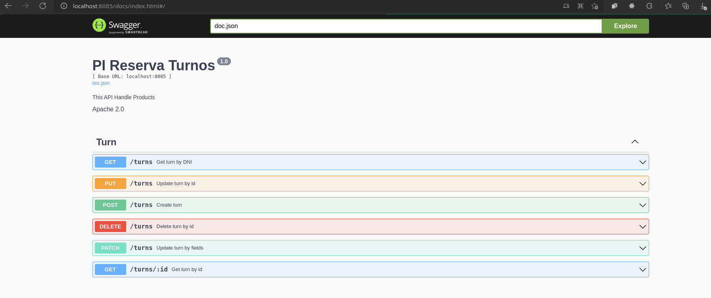
   
### 2- Base de datos:

docker compose up -d

Crear tablas con script db.sql

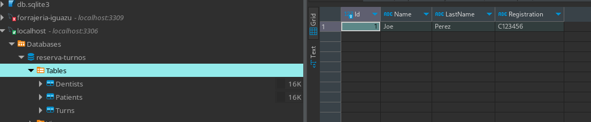

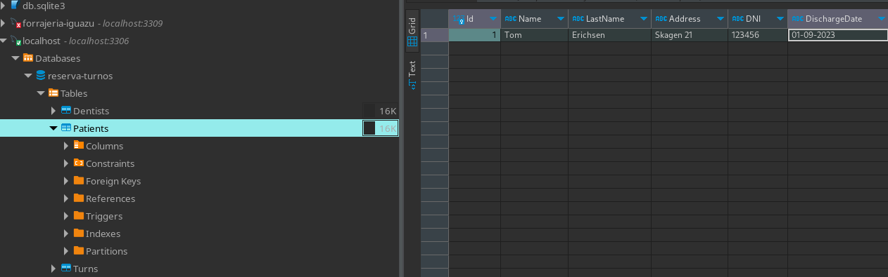

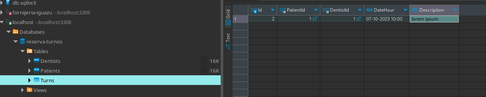

### 3- Postman:

#### Create turn

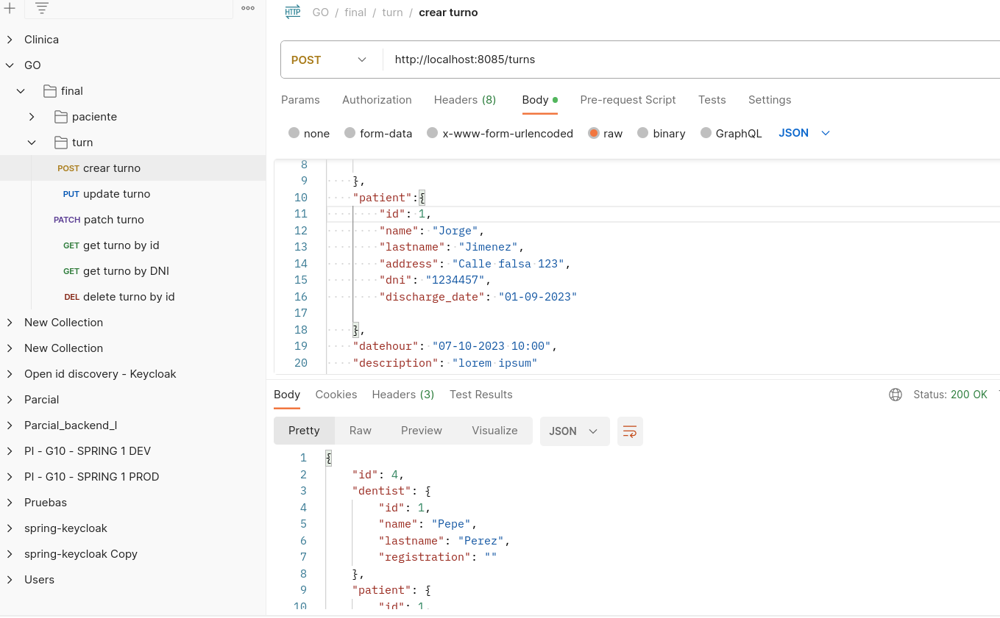

#### Update turn

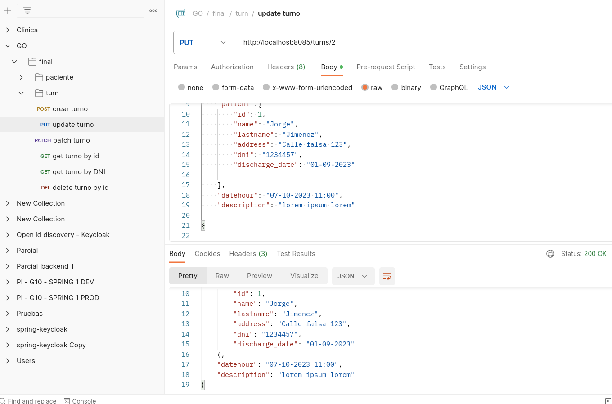

#### Patch turn

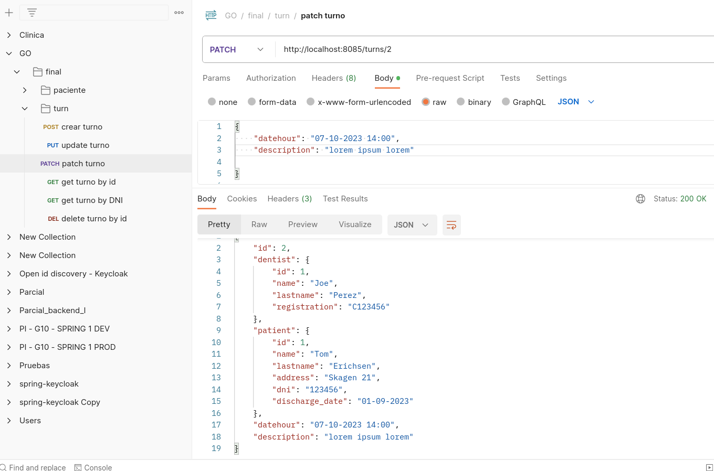

#### Get turn by id

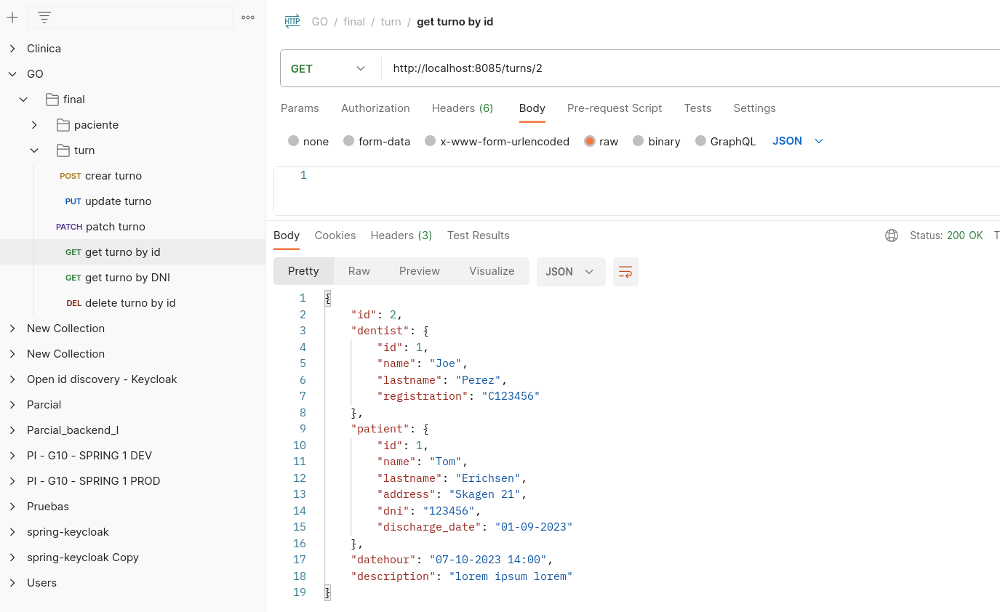

#### Get turn by dni

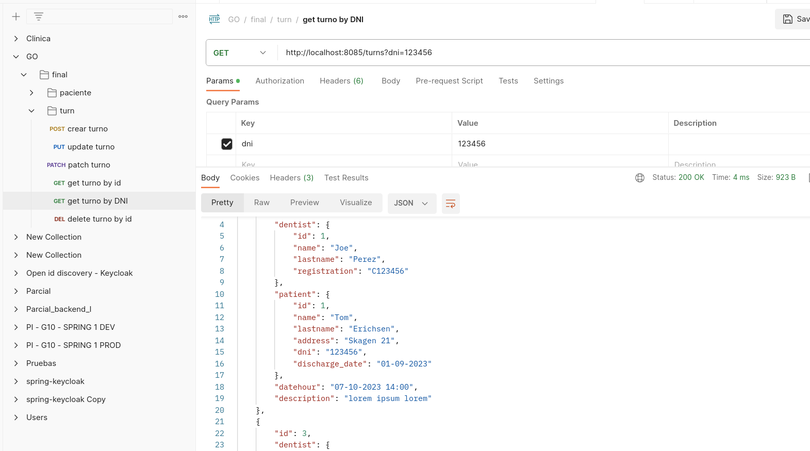

#### Delete turn

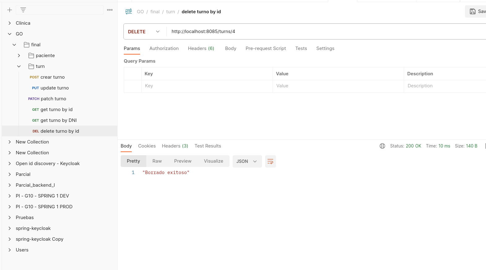

### 4- Middleware Auth

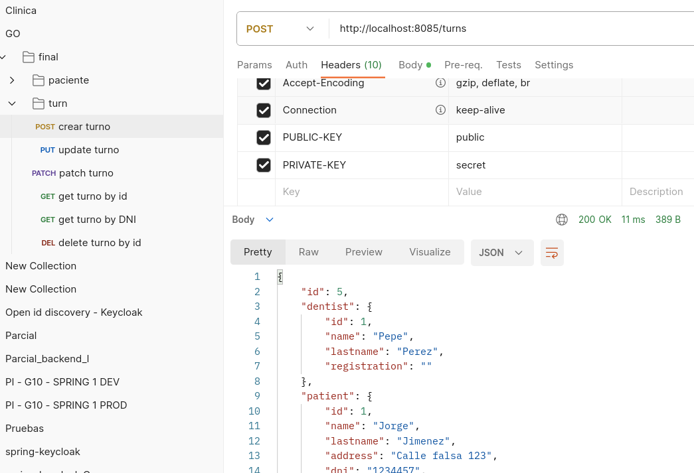

#### Con key erronea:

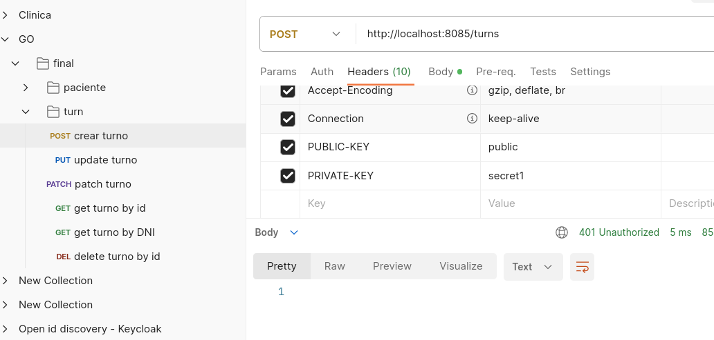
